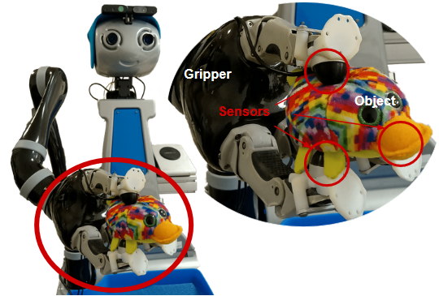

# Tactile object classification with the Jaco arm on the Doro robot sensorized with 3 OptoForce sensors #

This directory provides the dataset and the TensorFlow implementation for the tactile object classification with the Jaco arm on the Doro robot sensorized with 3 OptoForce sensors.
Please find the attached manual.py for full information.

## About the work ##

Philip Maus, Jaeseok Kim, OliviaNocentini, Muhammad Zain Bashir, and Filippo Cavallo 
Assisstive Robotics Laboratory, BioRobotics Institute Pontedera  
January 2021

## Prerequisites ##

* Python 3
* ROS kinetic
* Keras version 2.2.4
* TensorFlow version 1.14.

## Getting started ##

### Preparations ###

Download the folder Test. It includes:  
* A real-life data set
* A pretrained neural network model
* The Python routine predict_test.py

### Training ###

Navigate in the terminal to the Test folder and run: python3 predict_test.py

The prediction accuracy will be displayed in the terminal and a confusion matrix is saved in the folder Test.

## Citing ##

Feel free to use, modify, and share the code in this directory.  
However, please cite this work when you redistributed the code to others.  
Please contact me via email if you have any questions.  
